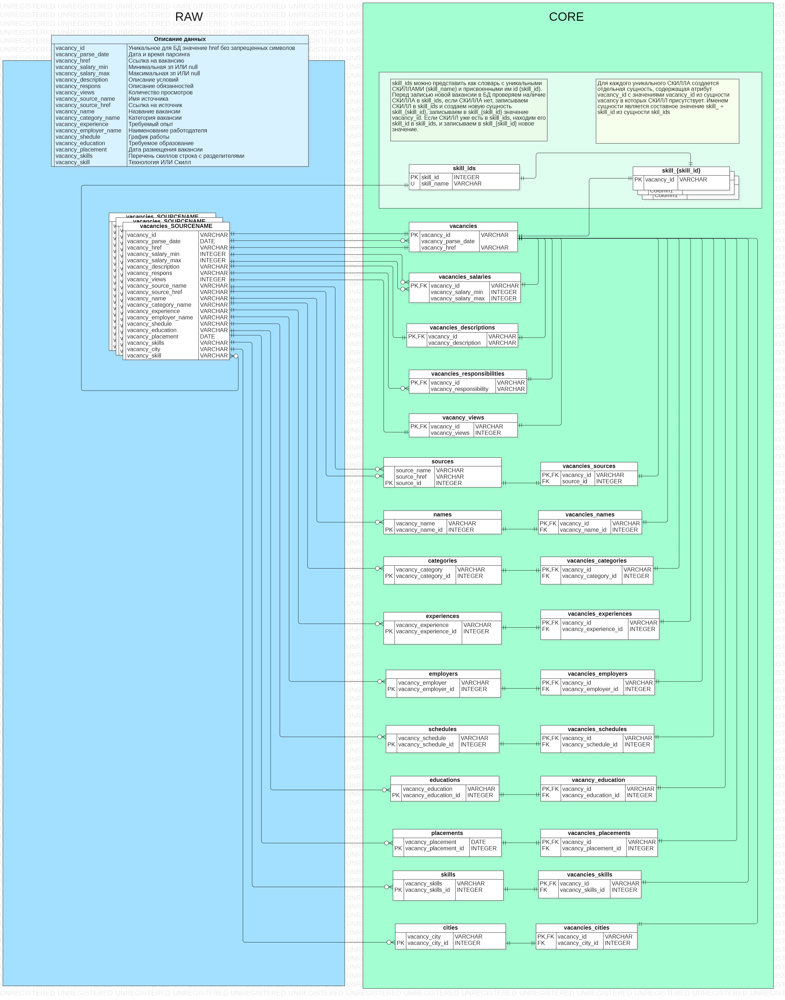

### job_portal

Запуск:   
`docker-compose up airflow-init`  
`docker-compose up`
***

Airflow DAGS:  
`set_vacancies_variables` - установка переменных и соединений `DONE`  
`create_db_store` - создание сущностей в БД `DONE`  
`load_data_to_db` - загрузка данных в БД `DONE`  
В процессе:  
Переписать парсеры  
Даги для парсеров  
Даг для запуска модели, очистки\обогащение данных  
Написать бэк для запросов к БД

Оптимизация:  
Пример запроса вакансий, отфильтрованных по 6 навыкам(скиллам) из 100k записей.
С разделением навыков по отдельным сущностям в БД позволяет выполнить запрос за 1.3с.
С применением индексации запрос выполняется за 0.4с  
Сгенерировать данные для теста можно с помощь `data_generator/data_generator.py`  
100k записей будут загружаться в БД ~30мин.  

Очередность записи Дагов:  
1) `create_db_store`  
2) `load_data_to_db`
```sql
select
	core_store.vacancies.vacancy_id,
	core_store.vacancies.vacancy_parse_date,
	core_store.vacancies.vacancy_href,
	core_store.categories.vacancy_category,
	core_store.cities.vacancy_city,
	core_store.vacancies_descriptions.vacancy_description,
	core_store.educations.vacancy_education,
	core_store.employers.vacancy_employer,
	core_store.experiences.vacancy_experience,
	core_store.names.vacancy_name,
	core_store.placements.vacancy_placement,
	core_store.vacancies_responsibilities.vacancy_responsibility,
	core_store.vacancies_salaries.vacancy_salary_min,
	core_store.vacancies_salaries.vacancy_salary_max,
	core_store.schedules.vacancy_schedule,
	core_store.skills.vacancy_skills,
	core_store.sources.source_name,
	core_store.sources.source_href,
	core_store.vacancies_views.vacancy_views
from core_store.skill_1
left join core_store.skill_2 on core_store.skill_2.vacancy_id = core_store.skill_1.vacancy_id
left join core_store.skill_3 on core_store.skill_3.vacancy_id = core_store.skill_2.vacancy_id
left join core_store.skill_4 on core_store.skill_4.vacancy_id = core_store.skill_3.vacancy_id
left join core_store.skill_5 on core_store.skill_5.vacancy_id = core_store.skill_4.vacancy_id
left join core_store.skill_6 on core_store.skill_6.vacancy_id = core_store.skill_5.vacancy_id
join core_store.vacancies on core_store.vacancies.vacancy_id = core_store.skill_6.vacancy_id
join core_store.vacancies_categories on core_store.vacancies_categories.vacancy_id = core_store.skill_6.vacancy_id
join core_store.categories on core_store.categories.vacancy_category_id  = core_store.vacancies_categories.vacancy_category_id
join core_store.vacancies_cities on core_store.vacancies_cities.vacancy_id = core_store.skill_6.vacancy_id
join core_store.cities on core_store.cities.vacancy_city_id  = core_store.vacancies_cities.vacancy_city_id
join core_store.vacancies_descriptions on core_store.vacancies_descriptions.vacancy_id = core_store.skill_6.vacancy_id
join core_store.vacancies_educations on core_store.vacancies_educations.vacancy_id = core_store.skill_6.vacancy_id
join core_store.educations on core_store.educations.vacancy_education_id  = core_store.vacancies_educations.vacancy_education_id
join core_store.vacancies_employers on core_store.vacancies_employers.vacancy_id = core_store.skill_6.vacancy_id
join core_store.employers on core_store.employers.vacancy_employer_id  = core_store.vacancies_employers.vacancy_employer_id
join core_store.vacancies_experiences on core_store.vacancies_experiences.vacancy_id = core_store.skill_6.vacancy_id
join core_store.experiences on core_store.experiences.vacancy_experience_id  = core_store.vacancies_experiences.vacancy_experience_id
join core_store.vacancies_names on core_store.vacancies_names.vacancy_id = core_store.skill_6.vacancy_id
join core_store.names on core_store.names.vacancy_name_id  = core_store.vacancies_names.vacancy_name_id
join core_store.vacancies_placements on core_store.vacancies_placements.vacancy_id = core_store.skill_6.vacancy_id
join core_store.placements on core_store.placements.vacancy_placement_id  = core_store.vacancies_placements.vacancy_placement_id
join core_store.vacancies_responsibilities on core_store.vacancies_responsibilities.vacancy_id = core_store.skill_6.vacancy_id
join core_store.vacancies_salaries on core_store.vacancies_salaries.vacancy_id = core_store.skill_6.vacancy_id
join core_store.vacancies_schedules on core_store.vacancies_schedules.vacancy_id = core_store.skill_6.vacancy_id
join core_store.schedules on core_store.schedules.vacancy_schedule_id  = core_store.vacancies_schedules.vacancy_schedule_id
join core_store.vacancies_skills on core_store.vacancies_skills.vacancy_id = core_store.skill_6.vacancy_id
join core_store.skills on core_store.skills.vacancy_skills_id  = core_store.vacancies_skills.vacancy_skills_id
join core_store.vacancies_sources on core_store.vacancies_sources.vacancy_id = core_store.skill_6.vacancy_id
join core_store.sources on core_store.sources.source_id = core_store.vacancies_sources.source_id
join core_store.vacancies_views on core_store.vacancies_views.vacancy_id = core_store.skill_6.vacancy_id
where core_store.skill_6.vacancy_id IS NOT null
```   
Время выполнения 1.3с  

Индексация:
```sql
create UNIQUE index categories_idx on core_store.categories (vacancy_category_id)
create UNIQUE index cities_idx on core_store.cities (vacancy_city_id)
create UNIQUE index educations_idx on core_store.educations (vacancy_education_id)
create UNIQUE index employers_idx on core_store.employers (vacancy_employer_id)
create UNIQUE index experiences_idx on core_store.experiences (vacancy_experience_id)
create UNIQUE index names_idx on core_store.names (vacancy_name_id)
create UNIQUE index placements_idx on core_store.placements (vacancy_placement_id)
create UNIQUE index schedules_idx on core_store.schedules (vacancy_schedule_id)
create UNIQUE index skills_idx on core_store.skills (vacancy_skills_id)
create UNIQUE index skills_ids_idx on core_store.skills_ids (skill_id)
create UNIQUE index sources_idx on core_store.sources (source_id)
create UNIQUE index vacancies_idx on core_store.vacancies (vacancy_id)
create UNIQUE index vacancies_categories_idx on core_store.vacancies_categories (vacancy_id)
create UNIQUE index vacancies_cities_idx on core_store.vacancies_cities (vacancy_id)
create UNIQUE index vacancies_descriptions_idx on core_store.vacancies_descriptions (vacancy_id)
create UNIQUE index vacancies_educations_idx on core_store.vacancies_educations (vacancy_id)
create UNIQUE index vacancies_employers_idx on core_store.vacancies_employers (vacancy_id)
create UNIQUE index vacancies_experiences_idx on core_store.vacancies_experiences (vacancy_id)
create UNIQUE index vacancies_names_idx on core_store.vacancies_names (vacancy_id)
create UNIQUE index vacancies_placements_idx on core_store.vacancies_placements (vacancy_id)
create UNIQUE index vacancies_responsibilities_idx on core_store.vacancies_responsibilities (vacancy_id)
create UNIQUE index vacancies_salaries_idx on core_store.vacancies_salaries (vacancy_id)
create UNIQUE index vacancies_schedules_idx on core_store.vacancies_schedules (vacancy_id)
create UNIQUE index vacancies_skills_idx on core_store.vacancies_skills (vacancy_id)
create UNIQUE index vacancies_sources_idx on core_store.vacancies_sources (vacancy_id)
create UNIQUE index vacancies_views_idx on core_store.vacancies_views (vacancy_id)
```  
Время выполнения 0.4с

Схема БД:

